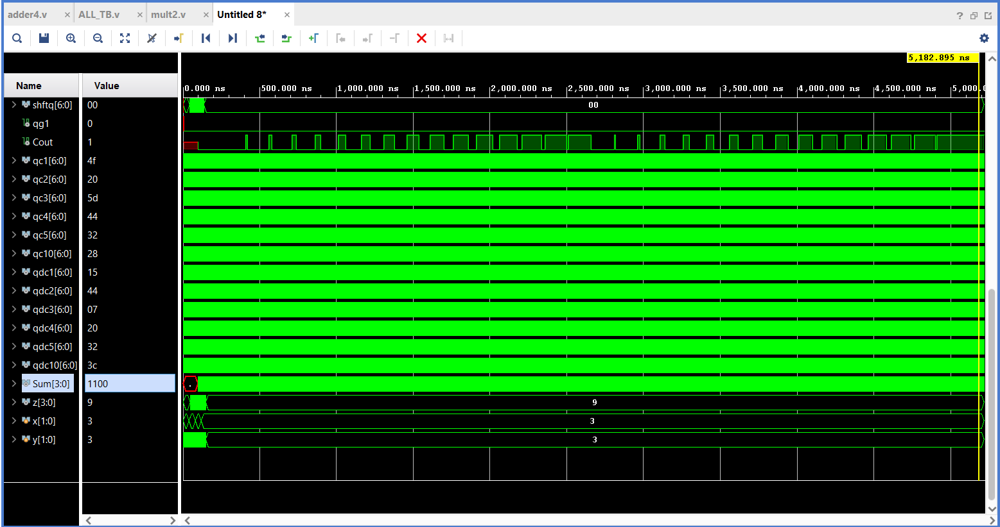

# Multi-Functional RTL Digital Design & Mini-ALU Library

This repository contains a modular collection of synthesizable Verilog HDL designs ranging from sequential control units to combinational arithmetic datapath modules, fully verified via AMD Xilinx Vivado.

---

## Modules Overview

### 1. Arithmetic & Datapath Units
* **`adder4.v`**: 4-bit Ripple-Carry Adder featuring full carry-propagation (`Cin` and `Cout`) evaluated with self-checking test vectors.
* **`mult2.v`**: 2-bit combinational binary multiplier implementing optimized gate-level logic.
* **`multiplexer_4.v` / `4multiplexer.v`**: Multiplexer logic routing multi-bit data selections.

### 2. Sequential & Register Units
* **`Counter_1.v`**: Modulo-100 parallel up-counter supporting simultaneous step intervals (+1, +2, +3, +4, +5, +10).
* **`Down_Counter1.v`**: Underflow-protected down-counter returning to limit values smoothly upon reaching zero threshold.
* **`Shift_Reg_4.v`**: 4-bit bidirectional shift register with synchronous control modes.

### 3. Logic Operational Unit
* **`Gates_1.v`**: Multi-functional combinational unit mapping standard Boolean primitives.

---

## Verification & Simulation (`ALL_TB.v`)

All designs are consolidated and simulated within a comprehensive testbench architecture:

* **Adder Verification:** Exhaustive testing across all $2^4 \times 2^4 \times 2^1 = 512$ combinations ($A$, $B$, and $Cin$).
* **Multiplier Verification:** Exhaustive testing across all 16 input permutations ($2^2 \times 2^2$).
* **Automated Self-Checking:** Implements assertion-like comparisons against golden behavioral models with zero reported mismatches (`hata = 0`, `hata_m = 0`).

---

## Tools & Environment
* **Language:** Verilog HDL (IEEE 1364-2001)
* **EDA Tool:** AMD Xilinx Vivado ML Edition
* **Timescale:** `1ns / 1ps`
